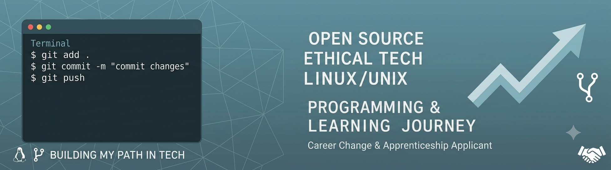

  

<h1 align="center">Hey, I'm Patrick 👋</h1>

  Linux • Open Source • Systems • Learning by building

---

## 👨‍💻 About me

I’m into technology in a very hands-on way.

Most of the time I’m not just using systems — I try to understand how they actually work underneath.

Over the years I’ve spent a lot of time with Linux, different operating systems, and virtualization setups. I’ve used and experimented with things like Proxmox, KVM, VirtualBox, GNOME Boxes and other hypervisor environments. I’ve also worked across different systems like Linux, BSD and macOS, often just by exploring and figuring things out.

I’d describe myself as a power user who likes to learn by doing, breaking things, and rebuilding them.

---

## 🚀 What I’m focusing on right now

- Learning software development properly (step by step)
- Getting more confident with Python and general programming basics
- Understanding how systems and software connect together
- Building a clearer structure in how I learn and work

---

## 🧠 Tech & tools I’ve worked with

- Linux (multiple distros, daily use & experiments)
- BSD & macOS
- Virtualization: Proxmox, KVM, VirtualBox, GNOME Boxes
- Basic server setups and self-hosting experiments
- Some exposure to Rust (understanding concepts, not production-level)
- Python (actively learning)

---

## 🤖 About AI & my learning style

I’ve also spent time experimenting with local AI tools like Ollama and small AI agents.

At the same time, I noticed something important for myself:

I don’t just want to rely on tools like AI to generate code — I want to understand what’s happening behind it.

For me, AI is a tool to support learning, not replace it. I want to be able to read, understand, and write code myself so I can actually work with these tools properly instead of depending on them blindly.

---

## ❤️ What I enjoy

- Understanding systems from the inside
- Open source and transparent technology
- Building small things and improving them over time
- Learning by experimenting
- Working across different operating systems and environments

---

## 📚 Current mindset

Still figuring things out, but moving towards more structure.

Less randomness, more understanding.

---

  <i>Still learning. Still building. Slowly getting better. 🚀</i>

